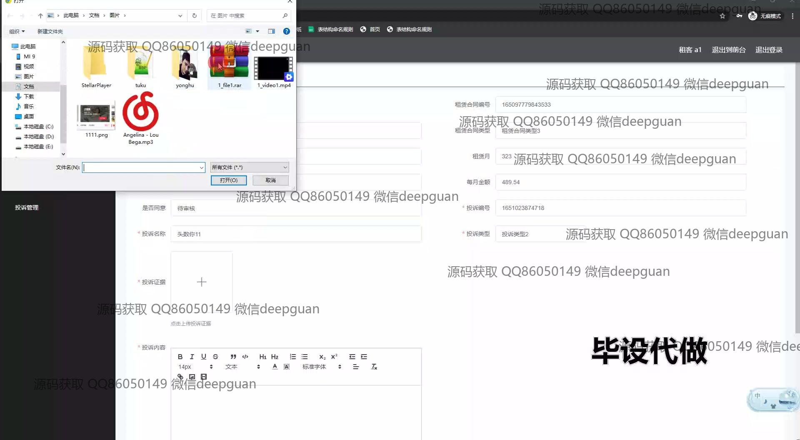
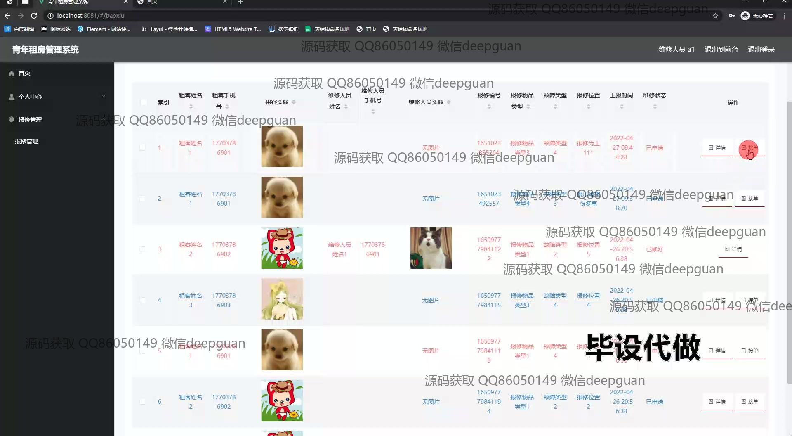

<h1 align="center">青年租房管理系统的设计与开发+vue</h1>

## 简介
青年租房管理系统：角色分为管理员、租客、房主；功能包含房屋管理、租赁合同管理、预约看房管理、报修管理、投诉管理，系统基于SSM和Vue框架，界面简洁直观。    --计算机毕业设计源码；毕设源码；java毕业设计源码

## 联系方式

<h3 align="center">获取完整代码与数据库文件 + 微信：deepguan QQ: 86050149 QQ群: 783742310</h3>

<h3 align="center">可帮忙远程部署 包运行成功！提供远程部署、修改代码、设计文档指导、代码讲解等服务！</h3>

## 功能介绍（完整见运行截图）
管理员： 提供登录、注册、修改密码及退出功能，支持系统角色管理与权限分配，可通过导航栏进入基础数据管理、房屋管理、租赁合同管理、预约审核、维修管理及投诉管理模块，能够审核预约看房、管理租赁合同、查看并处理报修信息、上传和管理合同文件，同时提供多种搜索和筛选功能以提高管理效率。

租客： 支持用户登录、注册、修改个人信息及退出操作，可在系统中浏览房屋列表、填写预约看房信息、提交维修报修单、查看预约状态和维修进度，拥有留言功能与合同信息查看权限，可上传所需材料并参与房屋管理相关流程，界面简洁易操作，满足租房需求。

房主： 提供房屋信息管理功能，支持房屋信息上传和编辑，包括房屋名称、面积、金额等字段，允许查看预约订单详情并与租客协作，能够上传租赁合同文件并填写合同相关信息如租金、押金等，同时支持处理租客的报修信息和投诉内容，优化房源管理效率。

客服： 负责处理租客的报修与投诉问题，提供操作按钮以接受工单或查看详情，能够对报修记录进行筛选和跟踪，支持编辑维修状态及更新维修进展，便于高效解决用户反馈，维护系统正常运行和服务质量。

## 运行截图

本代码来源于网络,仅供学习参考使用!

